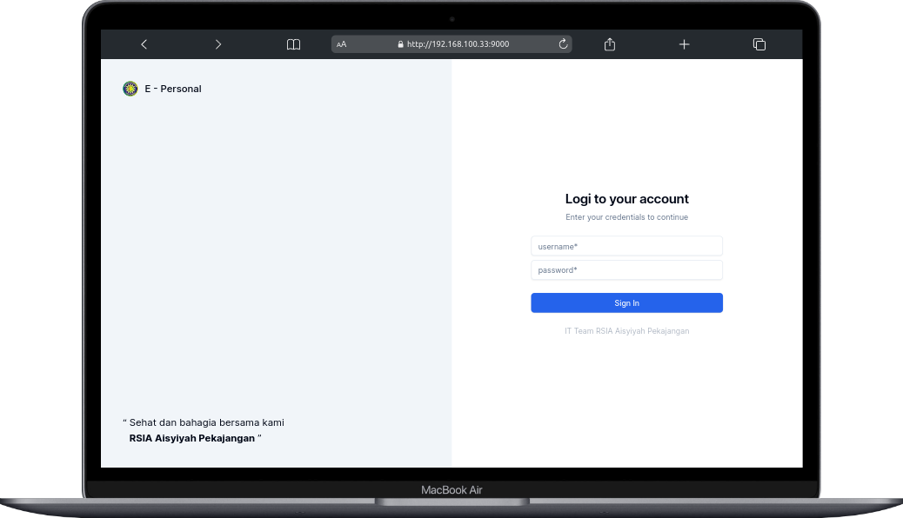
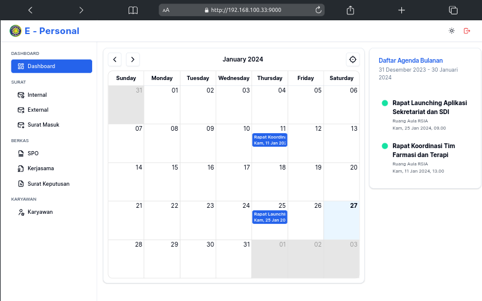

## E-Personal
e-personal adalah kepegawaian berbasis web yang dibuat dengan menggunakan next.js. fitur yang ada pada e-personal adalah sebagai berikut:

- [x] Manajemen data karyawan.
- [x] Manajemen berkas karyawan.
- [x] Manajemen surat-surat perusahaan. 

## Integrasi
aplikasi e-personal ini terintegrasi dengan aplikasi lain seperti aplikasi service self employee, yang berjalan di mobile. e-personal merupakan hasil dari integrasi `API` disisi back-end.

<!-- screenshoot -->
## Screenshoot
|     |     |
| --- | --- |
|  |  |

## Stack
- Next.js
- React.js
- Tailwind CSS
- shadcn
- react hot toast
- tabler icons

> [!IMPORTANT]
> Thanks to all creator of library that i use in this project. you can see in `package.json` file. 